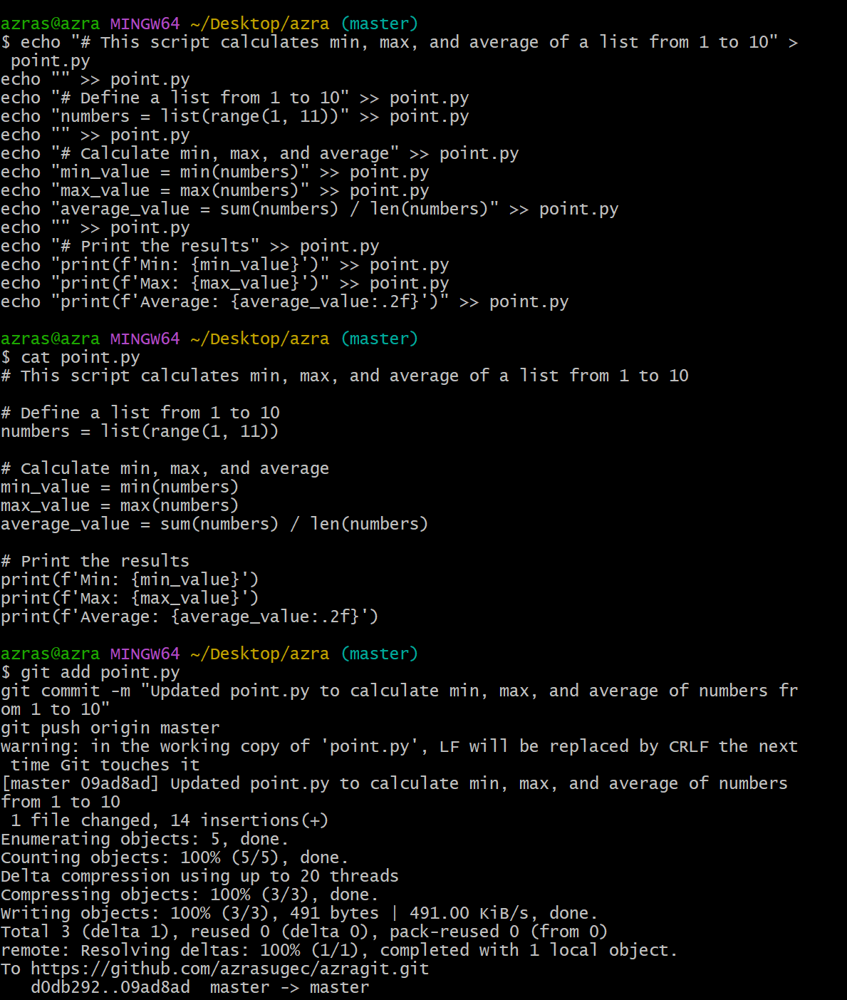

# ÂSSIGMENT #2

*This additional assignment includes the Git commands used during the assignment and the connection to Github.*

**1) GIT COMMANDS**

__First, we create our account in git and create the file that we will use for our homework. Then we made git work__

__Then we create the attachments named img, readme.md, tests, coordinates.csv, point.py *(touch & mkdir)* and add them to github *(add)*. After adding, we add a commit.__

*We loaded the visual plugins into the img file*

## Git Commands Used in This Assignment

| Command | Description |
|---------|-------------|
| `git init` | Initializes a new Git repository |
| `git add .` | Stages all changes for commit |
| `git commit -m "Message"` | Saves changes to the repository |
| `git status` | Displays the status of modified files |
| `git push origin master` | Pushes changes to GitHub |
| `cd directory_name` | Navigates to a specific directory |
| `echo "text" > file.txt` | Creates a new file and writes text into it |
| `mkdir folder_name` | Creates a new folder |
| `nano filename` | Opens a file in the terminal for editing |

# In addition

__In this study, we added coordinates and a simple level code line to the coordinate.csv and point.py attachments we created.__

**for coordinate.csv**

**for point.py**

_With this project, we transferred our work to github thanks to the git codes used between git and github._
